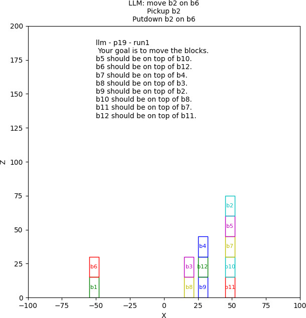

# ⏸️🔁▶️ Corrective Planning of Robot Actions

Code for the paper "Corrective Planning of Robot Actions with Large Language Models" submitted to ICRA24. \
Data and evaluation of the cocktail and blockstacking scenario from the paper.

For comparability, we relied on data from Liu et al.'s paper for the blockstacking experiments.
See Liu et al. (2023), LLM+P: Empowering Large Language Models with Optimal Planning Proficiency, [arXiv: arXiv:2304.11477](https://arxiv.org/abs/2304.11477)


## Contents
* Ground truth data
* Generated plans
* Evaluation framework


## Setup and use
Note: requires Python ^3.8.5

Set up a virtual environment with the dependencies:
```bash
./create_venv.sh
````
Run the cocktail evaluation:
```bash
./evaluate_cocktails.sh
```  
Run the blocksworld evaluation:
```bash
./evaluate_blockstacking.sh
``` 
The default settings run the experiments as described in the paper.

For the blockstacking experiment, you have different options:
- `-v`: Run the simulation for blockstacking.
- `-s SLEEP`: Set sleep duration (in seconds) between plan executions.
- `-b BREAK_AT`: Define the experiment where processing should stop.
- `-h`, `--help`: Show the help message.

### Examples

To run the blockstacking simulator in visual mode, with a 1-second pause between executions, stopping at experiment p20:

```bash
./evaluate_blockstacking.sh -v -s 1 -b p20
```

This command will open a simulation window as below:




To display the help message:

```bash
./evaluate_blockstacking.sh --help
```


## 🔖 Citation

For scientific use, please cite as follows:
```
@inproceedings{joublin2024correctiveplanning,
  title = {Corrective Planning of Robot Actions with Large Language Models},
  author = {Joublin, Frank and Ceravola, Antonello and Smirnov, Pavel and Ocker, Felix and Deigmoeller, Joerg and Belardinelli, Anna and Wang, Chao and Hasler, Stephan and Tanneberg, Daniel and Gienger, Michael},
  booktitle = {International Conference on Robotics and Automation (submitted)},
  publisher = {IEEE},
  year = {2024},
}
```

Contact:
- [Joerg Deigmoeller](mailto:joerg.deigmoeller@honda-ri.de)
- [Felix Ocker](mailto:felix.ocker@honda-ri.de)
